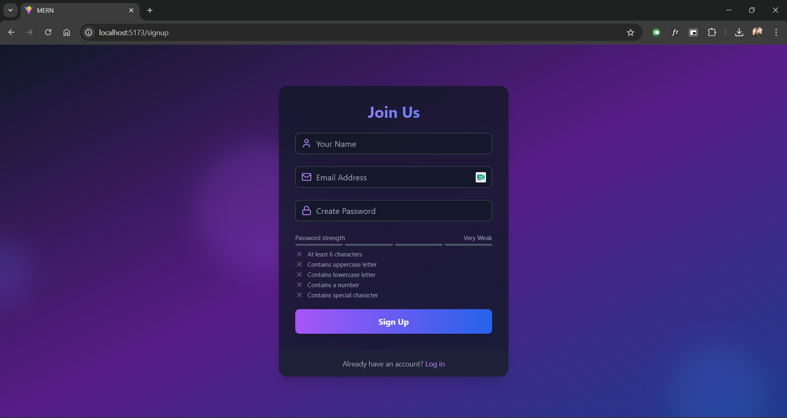

# MERN Authentication with Email Verification

  

## Project Description

This project implements user authentication with email verification using the MERN stack. It provides a secure signup and login process, along with email verification and password management features.

## Features

- **User Registration**: Signup with email and password.
- **Email Verification**: Send a verification email upon registration.
- **Login**: Authenticate users with their credentials.
- **Forgot Password**: Reset password functionality.
- **Secure Routes**: Protect sensitive pages from unauthorized access.

## Setup Instructions

### Environment Variables

Create a `.env` file in the root directory with the following variables:

```bash
MONGO_URI=your_mongo_uri
PORT=5000
JWT_SECRET=your_secret_key
NODE_ENV=development
MAILTRAP_TOKEN=your_mailtrap_token
MAILTRAP_ENDPOINT=https://send.api.mailtrap.io/
CLIENT_URL=http://localhost:5173
